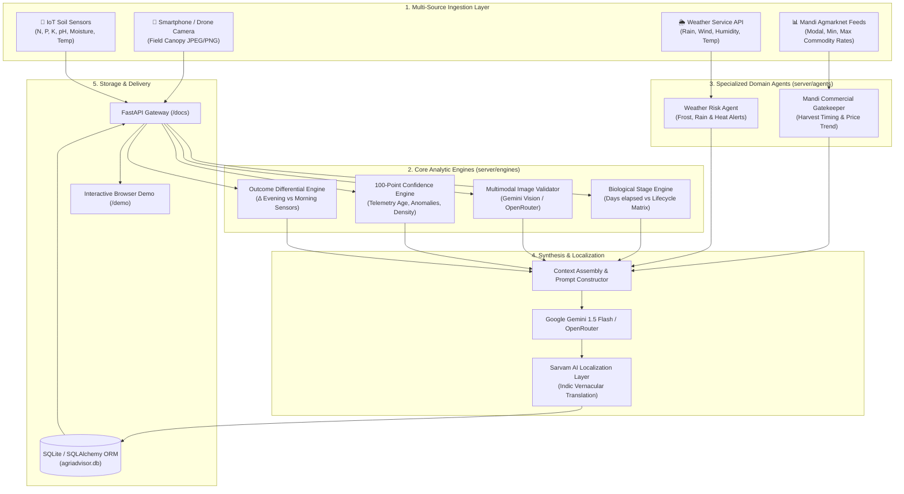
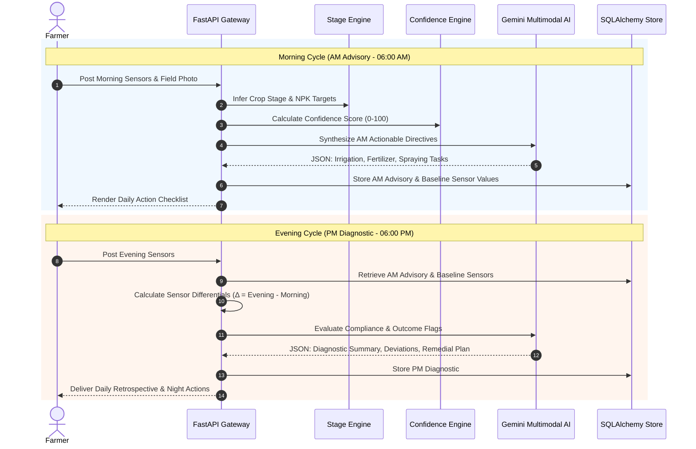
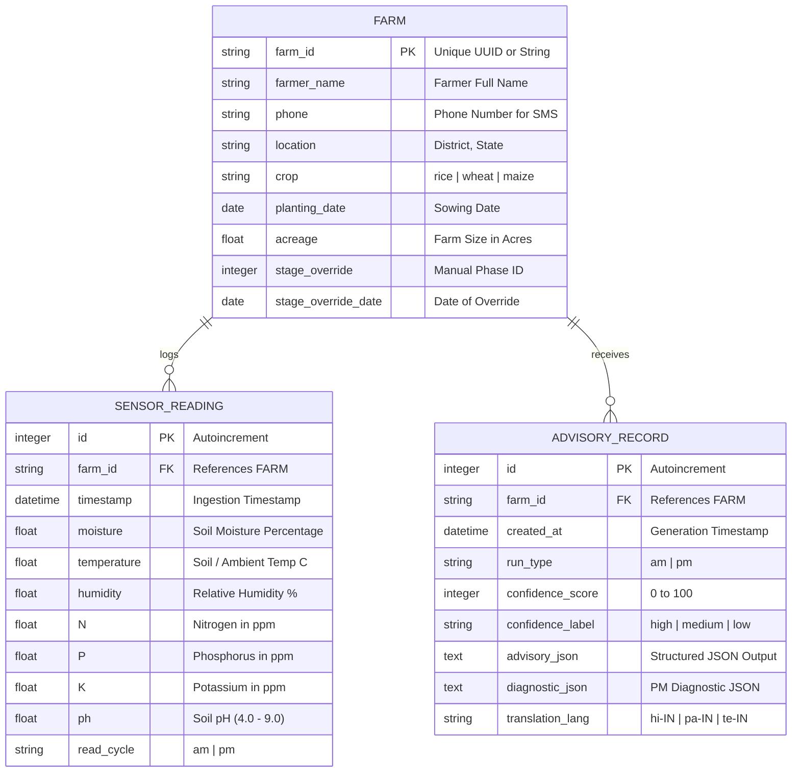

# 🌾 AgriAdvisor — Intelligent Multimodal Agricultural Decision Support System

[](https://www.python.org/)
[](https://fastapi.tiangolo.com/)
[](https://www.sqlalchemy.org/)
[](https://ai.google.dev/)
[](https://www.sarvam.ai/)
[](https://docs.pydantic.dev/)
[](LICENSE)

> Built for the **ET AI Hackathon 2026**, **AgriAdvisor** is a production-grade autonomous intelligence layer designed to deliver hyper-localized, crop-stage-aware daily agronomic advisories to Indian farmers. It ingests IoT soil telemetry, real-time meteorological forecasts, regional Mandi commodity prices, and visual crop canopy photography to generate dual-cycle morning (AM) action directives and evening (PM) outcome verification diagnostics.

---

## 📑 Table of Contents

- [1. Executive Summary & Problem Context](#1-executive-summary--problem-context)
- [2. High-Level System Architecture](#2-high-level-system-architecture)
- [3. Dual AM/PM Advisory Engine Lifecycle](#3-dual-ampm-advisory-engine-lifecycle)
  - [3.1 Morning (AM) Planning Pipeline](#31-morning-am-planning-pipeline)
  - [3.2 Evening (PM) Diagnostic & Outcome Differential](#32-evening-pm-diagnostic--outcome-differential)
- [4. Core Subsystems & Algorithmic Foundations](#4-core-subsystems--algorithmic-foundations)
  - [4.1 100-Point Confidence Scoring Engine](#41-100-point-confidence-scoring-engine)
  - [4.2 Crop Stage Biological Model](#42-crop-stage-biological-model)
  - [4.3 Multimodal Canopy Image Verification](#43-multimodal-canopy-image-verification)
  - [4.4 Mandi Market Gatekeeper](#44-mandi-market-gatekeeper)
  - [4.5 Vernacular Localization (Sarvam AI)](#45-vernacular-localization-sarvam-ai)
- [5. Database Schema & Persistence Layer](#5-database-schema--persistence-layer)
- [6. Complete REST API Reference & JSON Payloads](#6-complete-rest-api-reference--json-payloads)
- [7. Directory & Codebase Organization](#7-directory--codebase-organization)
- [8. Installation, Configuration & Local Execution](#8-installation-configuration--local-execution)
  - [8.1 Environment Variables Matrix](#81-environment-variables-matrix)
  - [8.2 Step-by-Step Setup](#82-step-by-step-setup)
- [9. Pre-Configured Hackathon Demo Scenarios](#9-pre-configured-hackathon-demo-scenarios)
- [10. Production Deployment & Scalability](#10-production-deployment--scalability)
- [11. Authors & License](#11-authors--license)

---

## 1. Executive Summary & Problem Context

Smallholder farmers across India face acute agronomic vulnerabilities due to unpredictable monsoon patterns, soil nutrient exhaustion, delayed pest identification, and asymmetric market prices. While low-cost IoT sensors and smartphones have proliferated, raw metrics (e.g. *"Soil Moisture = 34%"*, *"Nitrogen = 95 ppm"*) are not directly actionable for a farmer without expert agronomist interpretation.

**AgriAdvisor** bridges this gap by acting as an autonomous agronomic intelligence agent:
1. **Contextualizing Telemetry**: Grounding raw NPK, moisture, and pH numbers within the crop's biological growth timeline (e.g., *Rice Tillering* vs *Wheat Jointing*).
2. **Eliminating Guesswork**: Generating an actionable morning checklist (e.g., precise urea top-dressing dosages, specific irrigation volumes).
3. **Closing the Feedback Loop**: Running evening diagnostics comparing expected vs actual sensor outcome deltas to evaluate if recommendations were adopted and achieved the required physiological result.
4. **Removing Language Barriers**: Converting technical advisory payloads into conversational vernacular audio and text (Hindi, Punjabi, Telugu, etc.) using Sarvam AI.

---

## 2. High-Level System Architecture



---

## 3. Dual AM/PM Advisory Engine Lifecycle

AgriAdvisor operates on an asymmetric dual-cycle workflow mimicking an agronomist's daily routine:



### 3.1 Morning (AM) Planning Pipeline
1. **Telemetry Grounding**: Ingests morning soil values ($N, P, K, pH$, Moisture) and checks for physical plausibility (e.g. flagging impossible values like $Moisture > 95\%$ or all-zero NPK).
2. **Visual Cross-Examination**: Runs Gemini 1.5 Flash on canopy photos to verify phenological stage and identify visible leaf chlorosis or rust.
3. **Advisory Formulation**: Generates a strict structured JSON payload detailing:
   - **Irrigation Directive**: Exact litres/acre or duration in hours based on soil water deficit.
   - **Nutrient Directive**: Kilograms of Urea, DAP, or MOP required to match the stage target.
   - **Protective Sprays**: Target pests (e.g. Stem Borer, Aphids) and organic/chemical spray windows.

### 3.2 Evening (PM) Diagnostic & Outcome Differential
The evening engine validates whether the farmer took action and whether the soil responded as expected:
$$\Delta_{\text{metric}} = \text{Sensor}_{\text{evening}} - \text{Sensor}_{\text{morning}}$$
- **Moisture targeted in AM**: If $\Delta_{\text{moisture}} > +2\%$, status is marked `as_expected`. If $\Delta_{\text{moisture}} \in [-2\%, +2\%]$, flagged as `no_change` (farmer failed to irrigate or water evaporated under severe heat).
- **Nitrogen targeted in AM**: If $\Delta_{N} > +2\text{ ppm}$, recorded as `as_expected`. If negative or stagnant, flags a `nitrogen_application_deviation`.

---

## 4. Core Subsystems & Algorithmic Foundations

### 4.1 100-Point Confidence Scoring Engine (`server/engines/confidence.py`)
To prevent "hallucinated" or hazardous advice from reaching farmers, the system calculates an objective confidence rating before dispatching recommendations:

| Factor | Condition | Raw Points |
|---|---|---|
| **Canopy Image Freshness** | Image uploaded within current cycle (`used`) | **+25 pts** |
| | Image outdated from previous cycle (`outdated`) | **+8 pts** |
| | No image provided | **0 pts** |
| **Sensor Telemetry Density** | All 5+ sensor channels active ($N, P, K, pH, Moisture$) | **+20 pts** |
| | 4 active channels | **+12 pts** |
| | 3 active channels | **+6 pts** |
| **Telemetry Age** | Sensor read $< 1\text{ hour}$ ago | **+15 pts** |
| | Sensor read $1 - 6\text{ hours}$ ago | **+12 pts** |
| | Sensor read $6 - 12\text{ hours}$ ago | **+8 pts** |
| | Sensor read $12 - 24\text{ hours}$ ago | **+4 pts** |
| **Plausibility & Outliers** | 0 physical anomalies detected | **+15 pts** |
| | 1 anomaly detected | **+8 pts** |
| | $\ge 2$ anomalies detected | **0 pts** |
| **Weather Feed** | Real-time weather feed available | **+10 pts** |
| **Crop Model Calibration** | High-certainty staple crop (Rice, Wheat, Maize) | **+10 pts** |
| | Experimental / secondary crop | **+5 pts** |
| **Mandi Price Feed** | Active commodity price feed matched to harvest window | **+5 pts** |

**Categorical Thresholds**:
- **High Confidence ($\ge 75$)**: Unrestricted execution; automated SMS/voice alerts dispatched.
- **Medium Confidence ($50 - 74$)**: Standard execution with cautionary disclaimers.
- **Low Confidence ($< 50$)**: Advisory flagged with warning; advises physical field inspection.

---

### 4.2 Crop Stage Biological Model (`server/engines/stage_engine.py`)
Crop physiology is mapped to discrete agronomic stages anchored to the planting date. For example, in **Wheat**:

```text
Day 0          Day 21          Day 45          Day 85         Day 110        Day 135
  │───────────────│───────────────│───────────────│──────────────│──────────────│
CRI Stage     Tillering       Jointing         Heading       Milking        Maturity
(Crown Root)  (Vegetative)    (Rapid Growth)  (Flowering)    (Grain Fill)   (Harvest)
```

The engine tracks `days_into_phase` and `days_remaining_in_phase`. If extreme cold or delayed rains shift plant development, the farmer can submit a **Farmer Stage Override**, which recalibrates the baseline anchor day.

---

### 4.3 Multimodal Canopy Image Verification (`server/engines/image_validator.py`)
Uses base64-encoded image payloads transmitted to Gemini 1.5 Flash. The prompt instructs the vision model to verify leaf aspect ratio, chlorosis index, and canopy coverage. If the farmer uploads an image of a tractor or a non-crop object, the image validator returns `is_valid_crop=False` and rejects the photo from the confidence tally.

---

### 4.4 Mandi Market Gatekeeper (`server/agents/mandi_gate.py`)
Market advisory is automatically activated during late vegetative and grain filling phases (`mandi_active=True`). It tracks 7-day moving averages of regional Mandi modal prices and issues commercial advice:
- *Sell immediately* if prices peak above regional 30-day medians.
- *Hold grain in dry storage* if local arrivals have created an artificial price dip.

---

### 4.5 Vernacular Localization (`server/translation/sarvam.py`)
Integrates the Sarvam AI translation API to convert English-formatted technical JSON keys and advisory summaries into regional Indian scripts (Devanagari Hindi, Gurmukhi Punjabi, etc.), allowing direct integration with IVR (Interactive Voice Response) telephone systems.

---

## 5. Database Schema & Persistence Layer

The SQLite backend (`db/agriadvisor.db`) is managed through SQLAlchemy ORM models in `server/db/models.py`:



---

## 6. Complete REST API Reference & JSON Payloads

Interactive OpenAPI specification is available at `http://localhost:8000/docs`.

### 6.1 Register a Farm
- **`POST /farm/register`**
```json
// Request Body
{
  "farm_id": "FARM-PB-082",
  "farmer_name": "Gurpreet Singh",
  "phone": "+919876543210",
  "location": "Ludhiana, Punjab",
  "crop": "wheat",
  "planting_date": "2025-11-15",
  "acreage": 4.5
}

// Response (200 OK)
{
  "status": "success",
  "message": "Farm FARM-PB-082 registered successfully",
  "farm_id": "FARM-PB-082"
}
```

### 6.2 Ingest Sensor Telemetry
- **`POST /sensors/telemetry`**
```json
// Request Body
{
  "farm_id": "FARM-PB-082",
  "read_cycle": "am",
  "moisture": 34.2,
  "temperature": 22.5,
  "humidity": 68.0,
  "N": 95.0,
  "P": 180.0,
  "K": 120.0,
  "ph": 6.2
}

// Response (200 OK)
{
  "status": "recorded",
  "reading_id": 142,
  "flags": []
}
```

### 6.3 Trigger Morning (AM) Advisory
- **`POST /trigger/am`**
```json
// Request Body
{
  "farm_id": "FARM-PB-082"
}

// Response (200 OK)
{
  "run_type": "am",
  "farm_id": "FARM-PB-082",
  "stage": {
    "phase": 3,
    "phase_name": "Jointing Stage",
    "days_elapsed": 83,
    "days_remaining_in_phase": 12
  },
  "confidence": {
    "confidence_score": 88,
    "confidence_label": "high"
  },
  "actionable_directives": {
    "irrigation": {
      "action_required": true,
      "recommendation": "Apply 35mm light irrigation before 11:00 AM due to predicted wind gusts in the evening."
    },
    "fertilizer": {
      "action_required": true,
      "recommendation": "Top dress with 25 kg/acre Urea. Nitrogen levels (95 ppm) are currently trailing the 110 ppm jointing target."
    },
    "pest_warning": "Low risk. Maintain routine surveillance for yellow rust spores."
  },
  "vernacular_hi": "सुबह की सलाह: 11:00 बजे से पहले हल्की सिंचाई करें। प्रति एकड़ 25 किग्रा यूरिया का छिड़काव करें।"
}
```

### 6.4 Trigger Evening (PM) Diagnostic
- **`POST /trigger/pm`**
```json
// Request Body
{
  "farm_id": "FARM-PB-082"
}

// Response (200 OK)
{
  "run_type": "pm",
  "farm_id": "FARM-PB-082",
  "outcome_differential": {
    "moisture": { "morning": 34.2, "evening": 36.5, "delta": 2.3, "outcome": "as_expected" },
    "N": { "morning": 95.0, "evening": 112.0, "delta": 17.0, "outcome": "as_expected" }
  },
  "deviation_flags": [],
  "diagnostic_summary": "Irrigation and Nitrogen assimilation succeeded within biological tolerances. No remedial intervention required tonight."
}
```

---

## 7. Directory & Codebase Organization

```text
agri_advisory/
├── cache/
│   └── demo_cache.json              # Instant offline fallback for hackathon demonstrations
├── db/
│   └── agriadvisor.db               # SQLite operational store
├── demo/
│   └── index.html                   # Rich interactive single-page demo runner
├── server/
│   ├── agents/
│   │   ├── mandi_gate.py            # Mandi commodity pricing & harvest window agent
│   │   └── weather.py               # Meteorological ingestion & risk flagging
│   ├── data/
│   │   ├── demo_scenarios.py        # Curated test scenarios (Wheat, Rice Tillering, Grainfill)
│   │   ├── lifecycle_reference.py   # Crop phenology lookup tables
│   │   └── mandi_fixtures.py        # Static fallback market data
│   ├── db/
│   │   ├── database.py              # Engine, sessionmaker, and table bootstrapping
│   │   ├── models.py                # SQLAlchemy ORM definitions
│   │   └── queries.py               # Database access objects and queries
│   ├── engines/
│   │   ├── confidence.py            # 100-point multi-factor confidence rating
│   │   ├── image_validator.py       # Vision validation for crop imagery
│   │   ├── outcome_diff.py          # Day/night delta outcome differential engine
│   │   ├── stage_engine.py          # Biological crop calendar & override engine
│   │   └── trend.py                 # Multi-day telemetry moving average calculator
│   ├── pipeline/
│   │   ├── orchestrator.py          # Dynamic prompt assembly for Gemini/OpenRouter
│   │   └── pipeline_runner.py       # Async execution coordinator
│   ├── routers/
│   │   ├── advisory.py              # Advisory retrieval & trigger endpoints
│   │   ├── demo.py                  # Hackathon demo runner endpoints
│   │   ├── farm.py                  # Farm registration & profile management
│   │   └── sensors.py               # Sensor telemetry ingestion endpoints
│   ├── translation/
│   │   └── sarvam.py                # Sarvam AI API client for vernacular translation
│   ├── config.py                    # Environment variable loader
│   ├── main.py                      # FastAPI lifespan entry point & static mount
│   └── schemas.py                   # Pydantic v2 schemas
├── static/                          # High-resolution demo field photographs
│   ├── rice_grainfill.jpg
│   ├── rice_tillering.jpg
│   └── wheat_jointing.jpg
├── render.yaml                      # Render cloud infrastructure blueprint
├── requirements.txt                 # Exact pinned dependencies
└── runtime.txt                      # Python 3.11 runtime declaration
```

---

## 8. Installation, Configuration & Local Execution

### 8.1 Environment Variables Matrix

Create a `.env` file in the project root:

```ini
# Server Binding
SERVER_HOST=0.0.0.0
SERVER_PORT=8000

# Cache Settings (Set to true to use pre-cached responses for offline demo)
DEMO_CACHE_ENABLED=true

# AI Provider Credentials
GEMINI_API_KEY=AIzaSy...your_gemini_key
OPENROUTER_API_KEY=sk-or-v1-...your_openrouter_key
OPENROUTER_MODEL=google/gemini-flash-1.5
OPENROUTER_BASE_URL=https://openrouter.ai/api/v1
OPENROUTER_APP_NAME=AgriAdvisor

# Translation Credentials
SARVAM_API_KEY=your_sarvam_api_key_here
```

### 8.2 Step-by-Step Setup

```bash
# 1. Clone repository
git clone https://github.com/HarshM-Workspace/agri_advisory.git
cd agri_advisory

# 2. Initialize virtual environment
python -m venv venv
# Windows:
venv\Scripts\activate
# Linux/macOS:
source venv/bin/activate

# 3. Install dependencies
pip install -r requirements.txt

# 4. Launch FastAPI Server
python -m server.main
```

Once running, navigate to:
- **Interactive API Documentation**: [http://localhost:8000/docs](http://localhost:8000/docs)
- **Live Demo Runner**: [http://localhost:8000/demo/](http://localhost:8000/demo/)

---

## 9. Pre-Configured Hackathon Demo Scenarios

The platform includes 3 pre-built scenarios in `server/data/demo_scenarios.py` accessible via `/demo`:

1. **Scenario SC-02 — Wheat Jointing (Success Loop)**:
   - Day 83 of cycle. Morning moisture is low (34%), N is trailing (95 ppm).
   - Farmer applies recommended nitrogen and irrigation.
   - PM readings show moisture at 36.5% and N at 112 ppm (`as_expected` outcome).
2. **Scenario SC-03 — Rice Tillering (Deviation Loop)**:
   - Day 25 of cycle. High moisture (72%), stagnant nutrients.
   - Evening sensor checks detect that nitrogen stayed flat at 55 ppm.
   - PM diagnostic flags `deviation_flags: ["N"]` and issues a reminder.
3. **Scenario SC-04 — Rice Grain Filling (Mandi Price Gate Active)**:
   - Day 95 of cycle. Mandi Gatekeeper activates to cross-reference market price trends with harvest maturity.

---

## 10. Production Deployment & Scalability

- **Render Ready**: The repository includes `render.yaml` configuring a web service with Python 3.11, automatic migration, and static file mounting.
- **Stateless Intelligence**: The core pipeline relies on asynchronous I/O (`httpx`, `asyncio`), allowing horizontal pod autoscaling behind an API gateway like NGINX or AWS ALB.

---

## 11. Authors & License

- **Author**: Harsh Mishra ([@HarshM-Workspace](https://github.com/HarshM-Workspace))
- **License**: MIT License — see [LICENSE](LICENSE) for details.
